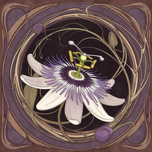

# Passiflora

Passiflora is a low-configuration cross-platform packager that wraps HTML/JavaScript/CSS/etc. in an executable (similar to Electron and its ilk, but far, far more efficiently). 

**Follow for updates: https://x.com/TonyHursh**

Much of this project was vibe coded as an experiment (see below).

Things are still moving fast, though it's to a point where I'm going to try to avoid breaking things. I expect to have a release candidate by the end of this week (April 17, 2026). I'm sure there are still some uglinesses and infelicities present. Please raise an issue if you notice anything amiss (especially security issues).

Supported host platforms:

* macOS  -- available targets: macOS, iOS, Android, Windows, and WWW
* Windows -- available targets: Windows, Android, and WWW
* Linux -- available targets: Linux, Windows, Android, WWW
* Need a different host or target? Open an issue... all suggestions will be considered, within the limits of time and efficiency.

Features:

* Access to device location data, cameras, mics, etc.
* Remote debugging
* POSIX(-ish) file system
* Code signing (generating ready-for-app-store packages) for macOS, iOS, and Android (support for the Google Play app store is under construction). These are still experimental. Please report any issues. Code signing for Windows is expected in a future release. See [#2](https://github.com/pulpgrinder/passiflora/issues/2).

What it *doesn't* do:

* Require that you install 50 million dubious npm packages (or a whole freakin' Rust ecosystem)
* Generate 60 petabyte binaries for a "Hello, world!" program
* Require configuration gymnastics -- there are no nasty-ass package.json scripts or even nastier-ass XML files -- no Maven, Ant, or Gradle config. Passiflora does *use* Gradle (technically gradlew) for Android builds, but you don't have to get the stench of it on you.

Unlike Electron, Passiflora uses the host system's own embeddable WebView object rather than bundling an entire browser into the executable. Bundling a web browser made sense back in the bad old days of incompatible browsers and highly-restricted web app functionality, but things have improved immensely since then.

### Executable Size

The sample program weighs 1.5 MB when built for macOS, 1.1 MB of which is accounted for by the .icns icon file. The actual executable code is only around 400 KB. 

By comparison, the same program when built for macOS using Electron/Electron Forge weighs **211 MB** --  more than **500 times larger**. Yikes!


Electron and Electron Forge also install **342** (!) npm packages, which generate scads of deprecation/security warnings (and, yes, I'm following the installation/compilation instructions on the Electron website that are current as of today, March 7, 2026).


## Prerequisites and Building

Detailed installation, build, cross-compilation, and code signing instructions are in the per-platform guides:

* **[Building on macOS](BUILD-macOS.md)** — native macOS builds, plus cross-compiling for iOS, Windows, Android, and WWW
* **[Building on Windows](BUILD-Windows.md)** — native Windows builds, plus cross-compiling for Android and WWW
* **[Building on Linux](BUILD-Linux.md)** — native Linux builds, plus cross-compiling for Windows, Android, and WWW

For signing targets, start from the top-level templates `signing_setup.sh` and `signing_setup.bat`, then copy to your private home keys folder (`~/passiflora-keys/` or `%USERPROFILE%\passiflora-keys\`) as documented in [BUILDING.md](BUILDING.md), [WINDOWS_SIGNING.md](WINDOWS_SIGNING.md), and [GOOGLE_PLAY_SIGNING.md](GOOGLE_PLAY_SIGNING.md).

### Quick Start

1. Install the prerequisites for your host system (see the guide above).
2. Check out a fresh copy of this repo.
3.  Step 3 is only necessary if you want to create a new GitHub project for your app. If you don't care about that, skip to Step 4. 

    To do this you'll (obviously) need a GitHub account. You'll also need the [GitHub CLI](https://cli.github.com/)).
    
    Create your own project from the checkout:

**macOS / Linux:**
```
make newproject
```

**Windows (PowerShell):**
```
.\build newproject
```

You'll be prompted for a new project name. This removes the connection to the Passiflora repo, creates a fresh Git history, and pushes to a new private GitHub repository under your account.

4. Put your HTML/JavaScript/CSS in `src/www`. As one might expect, your startup file should be named `index.html`.
5. Build:

**macOS / Linux:**
```
make
```

**Windows (PowerShell):**
```
.\build
```

6. There is no step 6, at least in the sense of building a functioning binary. You'll probably want to customize some of the settings to (e.g.) set your app's name, icon, and so on (see below).

For information on cross-compiling (e.g., building iOS apps on macOS), all available make/build targets, and per-platform guides, see **[BUILDING.md](BUILDING.md)**.


## Making the App Your Own

Obviously you'll want to put your own HTML, JavaScript, CSS, images, and such inside the src/www folder.  Use whatever framework, UI library, etc. you want --- or just plain vanilla HTML/JS/CSS. It's all good, mang (or womang, as you prefer). You may also want to cross-compile for a different system. See the per-platform guides for that.

Here are some other customizations you'll probably want to make before building something for release.

### Config

The file `src/config` controls the program name, display name, bundle identifier, permissions (e.g., whether the app is allowed to use the camera), allowed screen orientations, and so on. Multi-word display names (e.g., "Heckin Chonker") are fully supported — set `DISPLAYNAME` in `src/config` and Passiflora uses it for window titles, `.app` bundle names, `.exe` filenames, Linux binary names, and launcher labels across all platforms. See **[CONFIG.md](CONFIG.md)** for details.

### Icons

Passiflora can auto-generate the dozens of icons needed by the different platforms starting from a couple of large template icons. See **[ICONS.md](ICONS.md)**.


### Menus, Themes, and Font Stacks

Passiflora includes a (very basic) menu system (native menu bar + sliding menu + panel screens), 122 built-in color themes, and a curated set of font stacks. Full documentation is in **[MENUS-AND-THEMES.md](MENUS-AND-THEMES.md)**. Of course, you're welcome to ignore all this and roll your own UI, themes, menus, etc. It's all just standard HTML/JS/CSS. Churn out another boring-ass Bootstrap clone. Make it look like a Geocities page built by an 11-year-old back in 1994. The power is yours, my friend. You can rebuild it. You have the technology.


## File I/O

Passiflora includes POSIX-style file functions, Open/Save As/File Browser dialogs, and a virtual file system backed by IndexedDB. Full documentation is in **[FILE-IO.md](FILE-IO.md)**.

## Debugging

The WWW target produces a normal web page, allowing you to use standard browser dev tools for debugging. There's also a remote debugging system that can be enabled in the config file. This lets you execute JavaScript in a running app from an external browser window.

For details, see **[DEBUGGING.md](DEBUGGING.md)**.


## PassifloraConfig

Each build generates `src/www/generated/generated.js`, which includes a runtime `PassifloraConfig` object containing numerous values that may be useful at runtime. See **[PASSIFLORA-CONFIG.md](PASSIFLORA-CONFIG.md)**. Note that this is not the same as `src/config`, where you set the icons, name, etc. That's *compile-time* information. The build process uses the `src/config` file (and other compile-time information) to generate `src/www/generated/generated.js` for use at runtime. You shouldn't edit `src/www/generated/generated.js`, as any changes will be wiped out the next time you build.


## Utility Functions

There are numerous utility functions defined on the PassifloraIO object. See  **[UTILITY-FUNCTIONS.md](UTILITY-FUNCTIONS.md)**.


## About this project

This code was developed through an iterative process involving human-guided prompting of a large language model (LLM), followed by review, editing, refinement, and original contributions by the author. To the extent the work contains copyrightable human-authored elements (including structure, modifications, arrangements, and additions), it is Copyright (c) 2026 by Anthony W. Hursh. The project is distributed under the terms of the MIT License (see LICENSE file for full text). Portions generated directly by AI may not be independently copyrightable under current U.S. law.

The basic idea for this has been hanging around my todo list, along with code snippets, for several years. I finally decided to use it as a proof of concept for vibe coding. If it's of interest, the code per se was mostly written with GitHub Copilot using Claude Opus 4.6. Configuration questions and similar (e.g., "Why aren't location services working on my Ubuntu Linux system running in a Parallels Desktop VM?") were mostly handled with Grok 4.0. Both Grok and Claude were used to scan the package for potential security issues.


